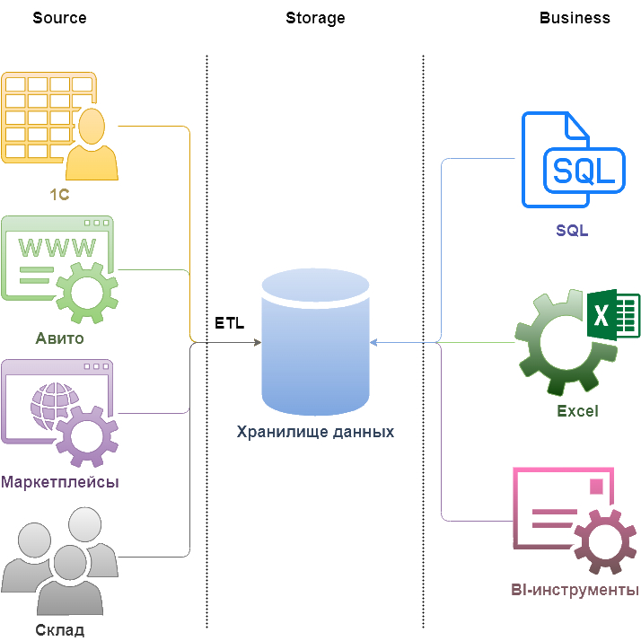
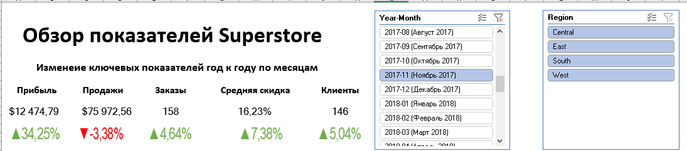
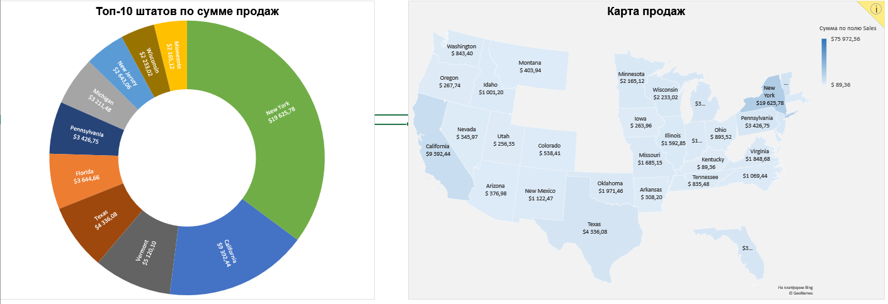
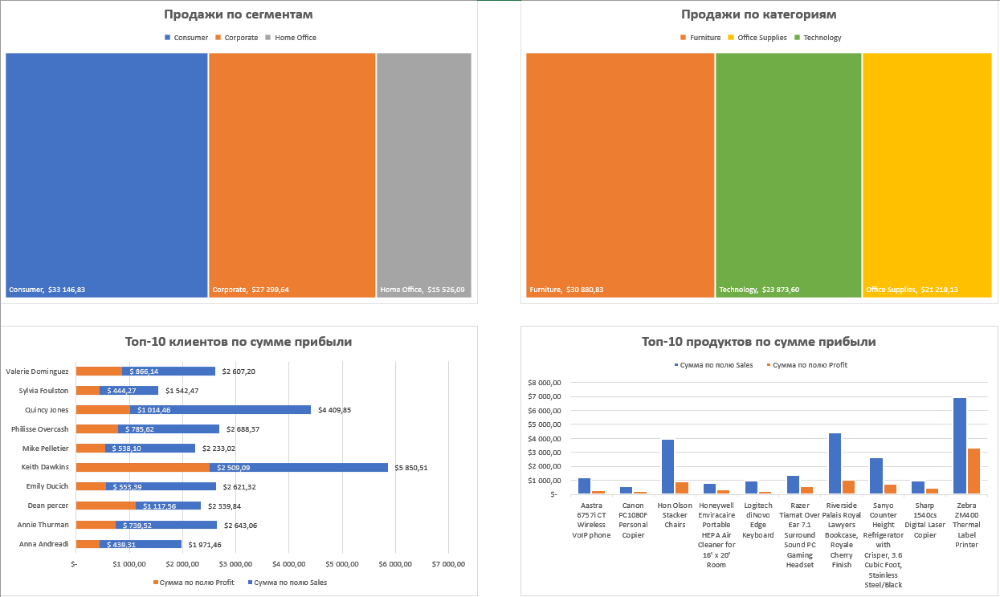

# Домашнее задание для модуля 1.

## Верхнеуровневая архитектура аналитического решения.

На данном изображении представлена архитектура аналитического решения для небольшой фирмы.
Представлены три слоя:
- Source Layer - слой источников данных;
- Storage Layer - слой хранения данных;
- Business Layer - слой для доступа к данным бизнес пользователей.

## Построение дашборда в Excel

С использованием инструментов Excel построен интерактивный дашборд на основе Sample Superstore Dataset со следующим наполнением:

- Обзор изменений ключевых показателей YoY по отношению к аналогичному месяцу предыдущего года;
- Топ-10 штатов по сумме продаж;
- География продаж;
- Сумма продаж по сегментам покупателей;
- Сумма продаж по категориям товара;
- Топ-10 клиентов по сумме прибыди;
- Топ-10 продуктов по сумме прибыли.

Переходим к Модулю 2

