# Модуль 2: Базы данных и SQL

Одним из заданий данного модуля является установка базы Postgres к себе на компьютер. Мне повезло, у меня есть доступ к серверу на котором уже крутится БД, в которую я могу писать свои данные, поэтому я сразу [*создал таблицу orders и загрузил в нее данные Superstore*](./stg_orders.sql).

*Однако до этого я уже поднимал локально MySQL, так что этот шаг я пропустил осознанно.*

## 2.3 Overview (обзор ключевых метрик)

Расчет показателей из Модуля 1.

  - Total Sales
  ```sql
  select sum(sales) as sum_sales
  from orders;
  ```
  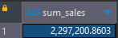
  - Total Profit
  ```sql
  select sum(profit) as sum_profit
  from orders;
  ```
  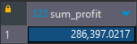
  - Profit Ratio
  ```sql
  select sum(sales) / sum(profit) as profit_ratio
  from orders;
  ```
  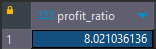
  - Profit per Order
  ```sql
  select 
  	order_id,
  	sum(profit) as sum_profit
  from orders
  group by order_id;
  ```
  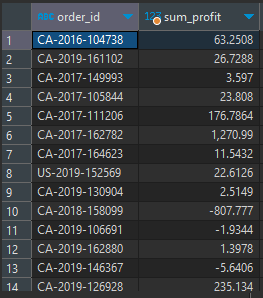
  - Sales per Customer
  ```sql
  select
	customer_id,
	sum(sales) as sum_sales
  from orders
  group by customer_id;
  ```
  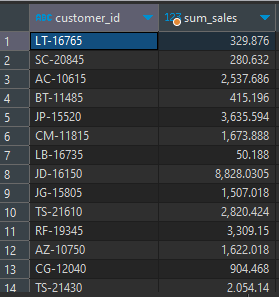
  - Avg. Discount
  ```sql
  select
	extract(year from order_date) as year,
	avg(discount) * 100 as avg_discount_pct
  from orders
  group by year;
  ```
  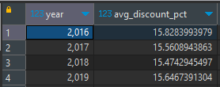
  - Monthly Sales by Segment
  ```sql
  select 
	segment,
	trim(to_char(order_date, 'Month')) as month,
	extract(year from order_date) as year,
	sum(sales) as sum_sales
  from orders
  group by segment, month, year
  order by segment, month, year;
  ```
  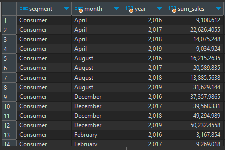
  - Monthly Sales by Product Category
  ```sql
  select 
	category,
	trim(to_char(order_date, 'Month')) as month,
	extract(year from order_date) as year,
	sum(sales) as sum_sales
  from orders
  group by category, month, year
  order by category, month, year;
  ```
  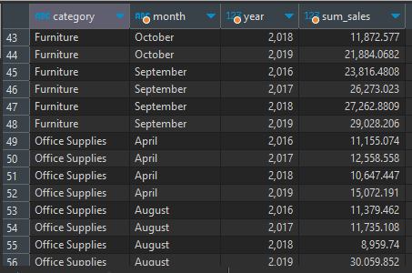
 ### Customer Analysis
  - Sales and Profit by Customer
  ```sql
  select
	customer_id,
	sum(sales) as sum_sales,
	sum(profit) as sum_profit
  from orders
  group by customer_id;
  ```
  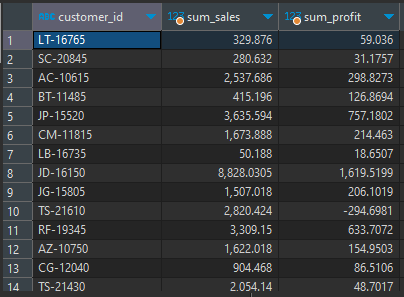
  - Customer Ranking
  ```sql
  select 
	customer_id,
	row_number() over (order by sum(profit) desc) as rank_by_profit,
	sum(sales) as sum_sales,
	sum(profit) as sum_profit
  from orders
  group by customer_id;
  ```
  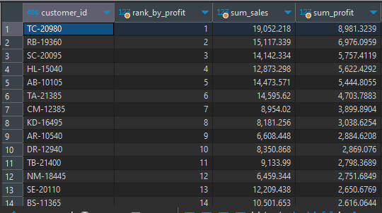
  - Sales per region
  ```sql
  select
	region,
	sum(sales) as sum_sales
  from orders
  group by region;
  ```
  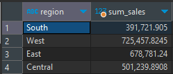

## 2.4 Физическая модель данных

С помощью сервиса Sqldbm нарисовал модель данных:

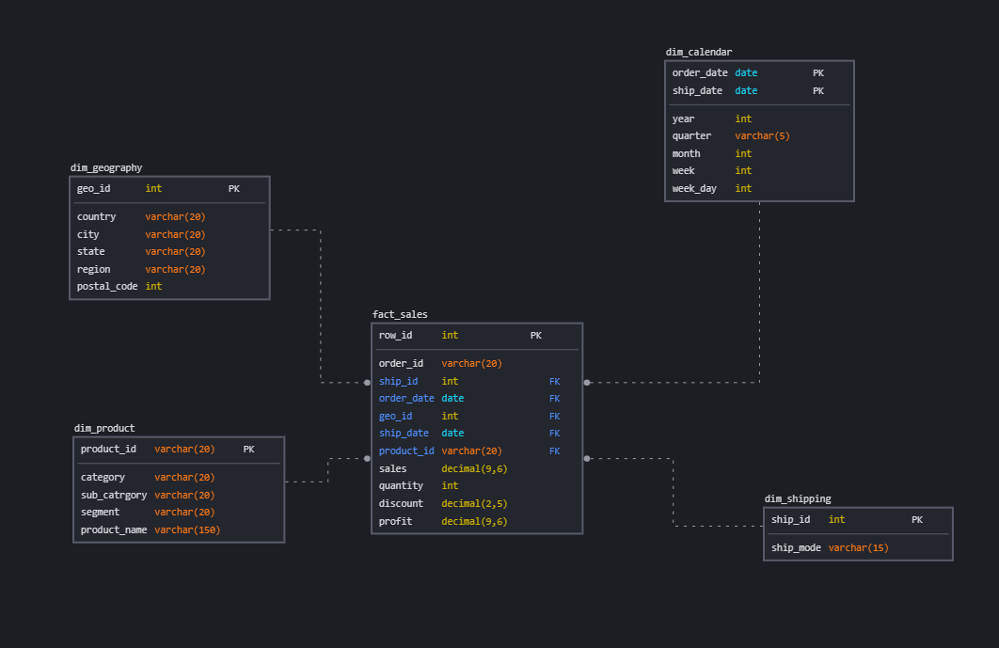

## 2.5 База данных в облаке

Так как в данный момент AWS и GCP недоступны для пользователей из России, изучил информацию по Yandex.Cloud, однако решил пока не разворачивать облачное хранилище, буду пользоваться удаленным сервером (в принципе чем не облако🤔).

[Создал таблицы по приведенной выше модели и наполнил их данными](./dwh.sql).

## 2.6 Как донести данные до бизнес-пользователя

В качестве BI-инструмента решил использовать DataLens от Yandex (*очень вовремя пришелся бесплатный курс по визуализации данных от Нетологии*)

### Подключение к БД (DataLens)

Первое, что нам нужно сделать - **создать подключение к нашей БД**.

- Создаем новое подключение

	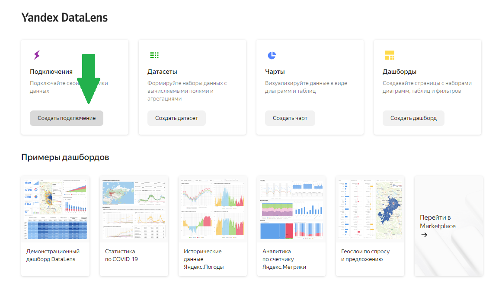

- Выбираем Postgres (*хотя тут есть поле для экспериментов, если конечно есть доступ к соответсвующей БД*)

	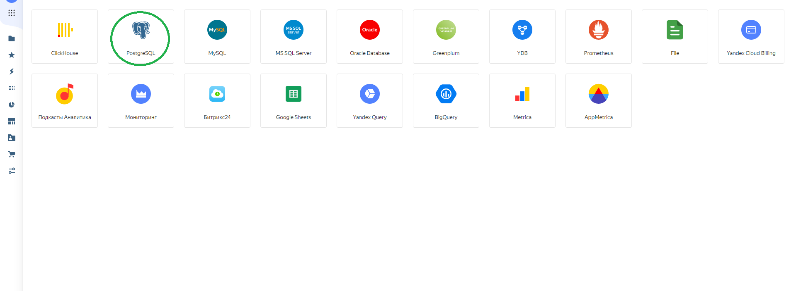

- Настраиваем подключение, стоит обратить внимание, что DataLens по умолчанию ставит порт 6432, хотя обычно у Постгреса он **5432**

	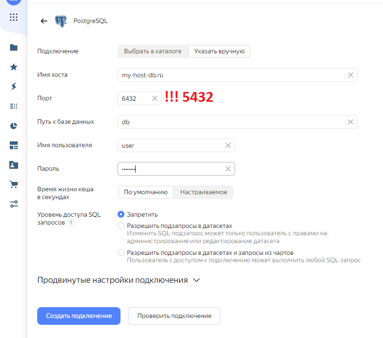

- Проверяем подключение, если все правильно ввели выше, то должна быть зеленая галка :)

	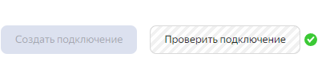

### Создание Датасета (DataLens)

Следующий пункт, который нам необходимо выполнить - **создать Датасет**, на основе которого уже будут строиться дашборды.

- Создаем новый датасет:

	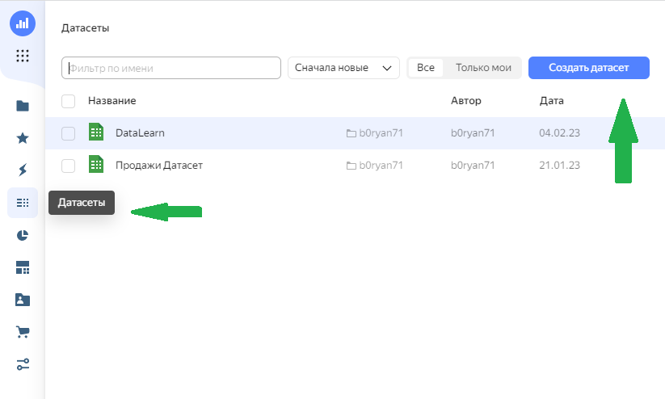

- Добавляем наше подключение к БД:

	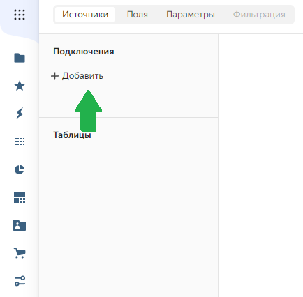

- Выбираем таблицы из которых будут браться данные.
	Так как схема нашего хранилища данных - *звезда*, сначала выбираем фактовую таблицу, к которой по сути, силами DataLens`а джойним таблицы-измерения.

	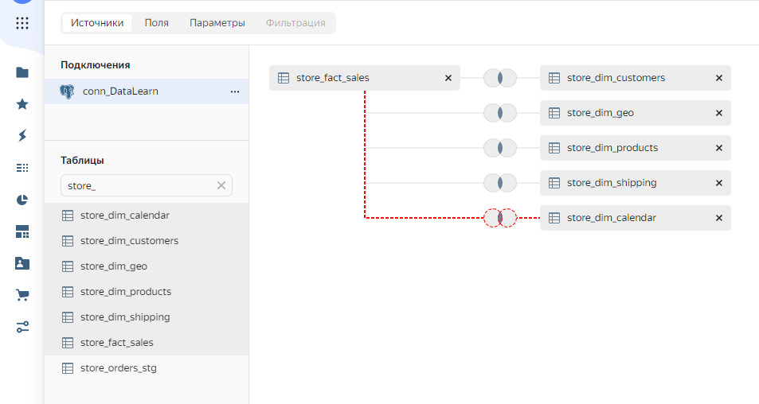

- Измерение **Календарь** автоматом соединяться не захотело, поэтому ручками выставляем связь по ***order_date_id*** и ***date_id*** (*хотя связь по ship_date_id тоже возможна, но не будем пока нагромождать*).

	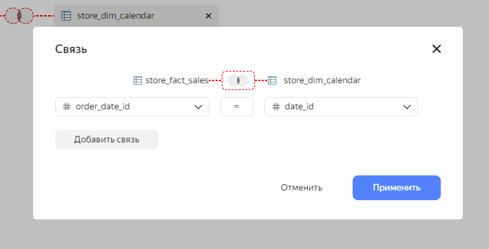

### Создание Чартов (DataLens)

Далее, прежде чем мы сформируем наш дашборд, необходимо создать чарты. Чарт - по сути деталь дашборда - любой график или диаграмма.

- Создаем новый чарт:

	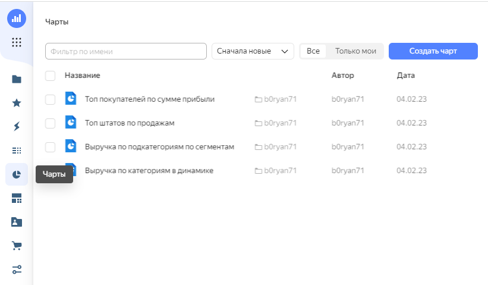

- Подключаем наш датасет и выбираем необходимые для построения графика показатели. Особо расписывать тут не буду, у кого на что хватит фантазии. На рисунке ниже пример - сумма продаж по годам по каждой подкатегории товаров:

	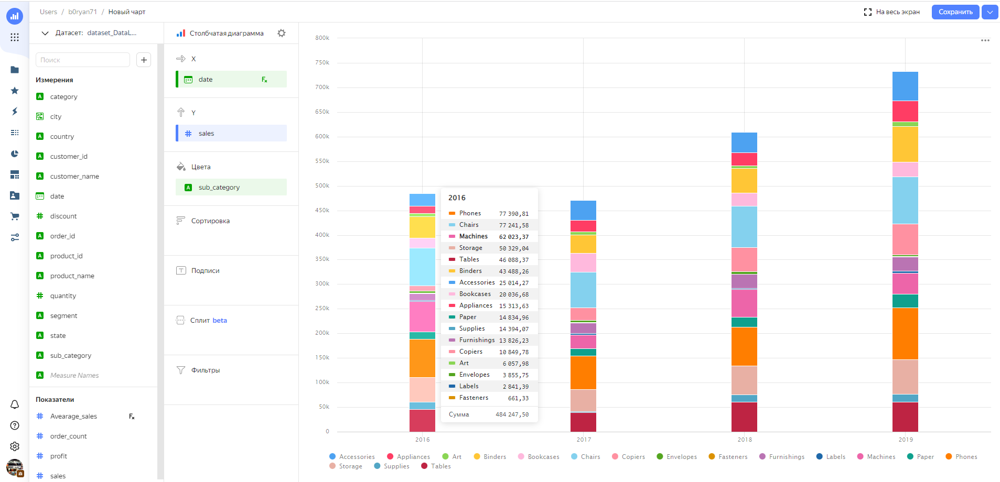

- Сохраняем чарт, потом будем размещать его на дашборде.

### Создание Дашборда

Финальный продукт нашей работы - дашборд.

- По такой же схеме, как и с датасетами и чартами, создаем новый дашборд и размещаем там наши чарты:

	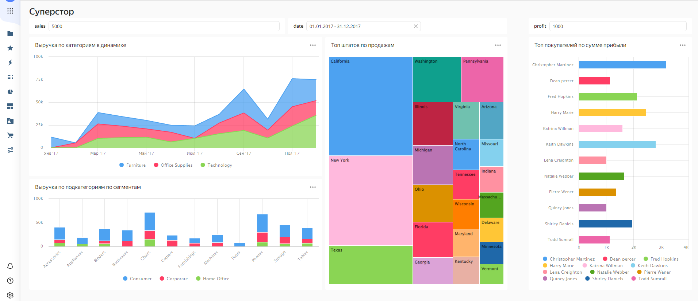

- Здесь стоит остановиться на *селекторах*:

	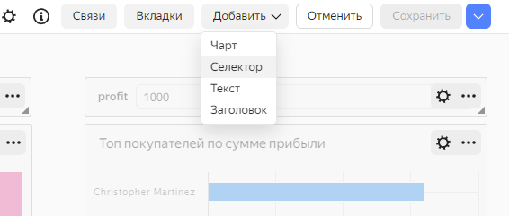
	Фильтровать данные можно либо в самом чарте, либо с помощью селектора. 
	
	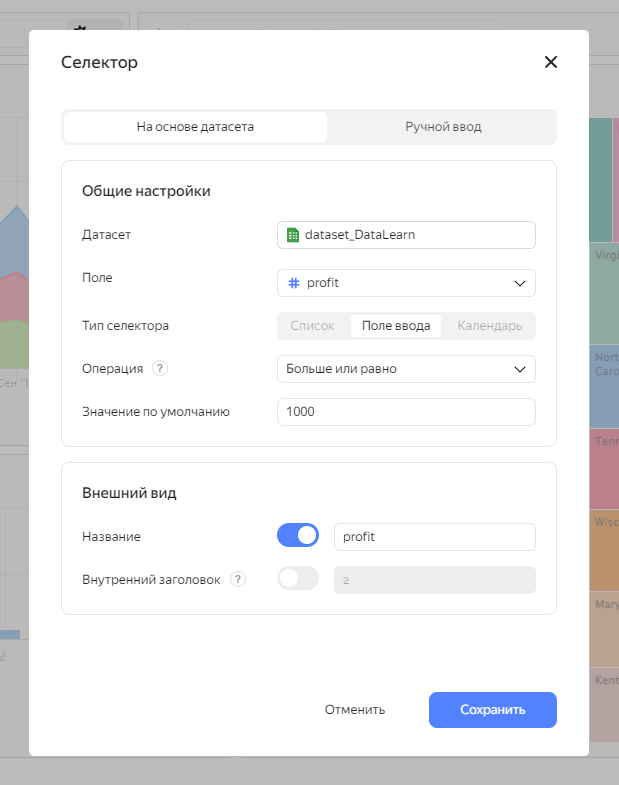

	На вкладке *Связи* можно выбирать к какому чарту подлючается селектор. 

	

Теперь самое время переходить к Модулю 3 :)