### Overview (обзор ключевых метрик)
  - Total Sales
  ```sql
  select sum(sales) as sum_sales
  from orders;
  ```
  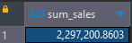
  - Total Profit
  ```sql
  select sum(profit) as sum_profit
  from orders;
  ```
  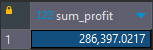
  - Profit Ratio
  ```sql
  select sum(sales) / sum(profit) as profit_ratio
  from orders;
  ```
  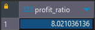
  - Profit per Order
  ```sql
  select 
  	order_id,
  	sum(profit) as sum_profit
  from orders
  group by order_id;
  ```
  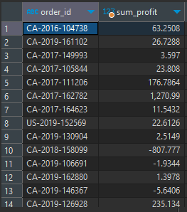
  - Sales per Customer
  ```sql
  select
	customer_id,
	sum(sales) as sum_sales
  from orders
  group by customer_id;
  ```
  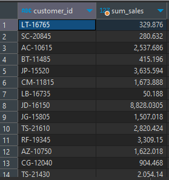
  - Avg. Discount
  ```sql
  select
	extract(year from order_date) as year,
	avg(discount) * 100 as avg_discount_pct
  from orders
  group by year;
  ```
  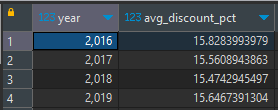
  - Monthly Sales by Segment
  ```sql
  select 
	segment,
	trim(to_char(order_date, 'Month')) as month,
	extract(year from order_date) as year,
	sum(sales) as sum_sales
  from orders
  group by segment, month, year
  order by segment, month, year;
  ```
  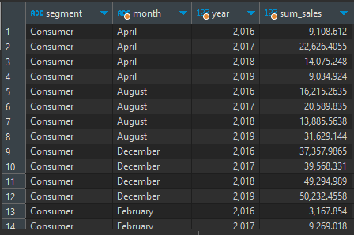
  - Monthly Sales by Product Category
  ```sql
  select 
	category,
	trim(to_char(order_date, 'Month')) as month,
	extract(year from order_date) as year,
	sum(sales) as sum_sales
  from orders
  group by category, month, year
  order by category, month, year;
  ```
  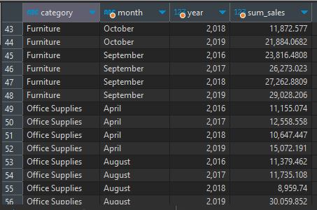
 ### Customer Analysis
  - Sales and Profit by Customer
  ```sql
  select
	customer_id,
	sum(sales) as sum_sales,
	sum(profit) as sum_profit
  from orders
  group by customer_id;
  ```
  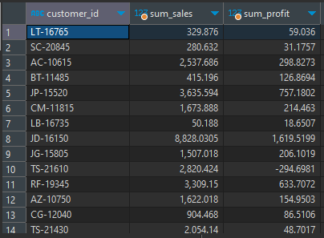
  - Customer Ranking
  ```sql
  select 
	customer_id,
	row_number() over (order by sum(profit) desc) as rank_by_profit,
	sum(sales) as sum_sales,
	sum(profit) as sum_profit
  from orders
  group by customer_id;
  ```
  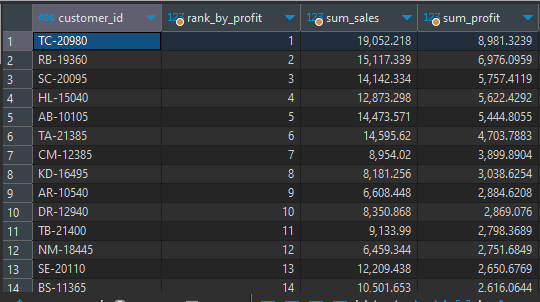
  - Sales per region
  ```sql
  select
	region,
	sum(sales) as sum_sales
  from orders
  group by region;
  ```
  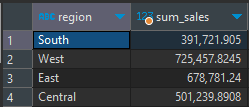

### Физическая модель данных

![star_model] (./star_model.bmp)