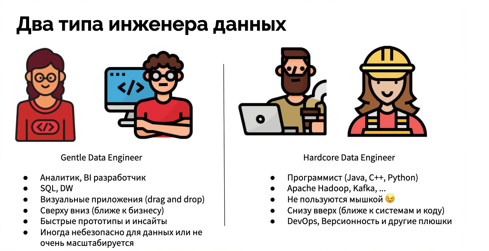

## 1.6: Два типа инженера данных
Мне очень нравится слово ИНЖЕНЕР. Я сам по специальности Инженер-конструктор. Для меня инженер - это профессионал, который может посмотреть на предмет и мысленно его разобрать на составные части, найти неисправность в неработающем предмете или создать новый предмет на базе требований заказчика, используя свои профессиональные инструменты. 

Инженер не знает всё обо всём, он понимает базовые принципы и видит конечную цель, а дальше с использованием инструментария и навыков он творит.

Инженеры бывают разные, мы будет говорить про инженеров, которые работают с данными. Не знаю, как у вас, но до Амазона я термин *data engineer* не использовал, вместо инженера были просто *разработчики* и *специалисты*:
- Разработчик ПО
- Разработчик Отчетов
- Специалист data mining
- BI Разработчик
- ETL разработчик
- DW разработчик

И еще были *архитекторы*: все те же слова, но с дополнением "архитектор" - это значит уже опытный специалист, который может не просто что-то делать, но и создавать архитектуру решения (DW, BI, ETL).

Прежде всего, для меня существует два типа Инженера Данных:
1.	Программист, который стал Инженером Данных.
2.	BI/DW/ETL-разработчик, который стал Инженером Данных.

Давайте подробнее рассмотрим отличия. Задача Инженера Данных - создание платформы, куда автоматически загружаются данные, там они трансформируются в доступную форму для конечных пользователей (как правило, бизнес-пользователей). 

Источники данных могут быть различными: реляционные базы данных, SFTP, API, файлы с логами, сенсоры. Типа данных также могут быть различными: структурированные данные в табличном формате, полуструктурированные (JSON, XML) и неструктурированные (видео, аудио).

В зависимости от бизнес-требований, Инженеру Данных необходимо создать поток данных (data pipeline), который автоматически будет забирать данные и загружать их в платформу данных (хранилище данных или озеро данных). Вам необходимо выбрать инструменты для работы с данными. 

Цель у нас простая: помочь бизнесу извлечь ценную информацию из данных. Для этого нужно создать аналитическое решение, где пользователи могут самостоятельно работать с данными, проверять свои гипотезы и анализировать бизнес-задачи, используя правильные метрики. 

Чтобы построить такое решение, нужен Инженер Данных. В моем случает это не просто создание потока данных, трансформация и загрузка данных. Это полноценная работа с бизнес-подразделениями, понимание их нужд и предоставление им инструментов для решения их задач. 

Я имею в виду весь цикл построения аналитического решения. Именно это мы будем изучать на курсе. 

И теперь самое интересное: в зависимости от вашего опыта, вы можете использовать языки программирования Java/Python и т.д. для создания решения - Инженер Данных №1 (*Technical Data Engineer*), а можете использовать готовые решения, которые позволят вам создавать масштабируемые и безопасные решения, быстро достигать результатов - Инженер Данных №2 (пусть будет *Result Oriented Data Engineer*). 

Без программирования не обойтись даже для 2-го типа, но вам не нужно быть гуру программирования, достаточно понимать, как работает Python, и использовать небольшие куски кода для кастомизации решения. 

**Главное в этом курсе не зубрежка программирования или конкретного продукта, а понимание принципов работы с данными, классов инструментов и возможных бизнес-задач и пути их решения, а для всего остального есть Google;)**